# React Simpsons API GUI

[](https://expo.dev/)
[](https://react.dev/)
[](https://reactnative.dev/)
[](https://www.typescriptlang.org/)
[](#license)

A portfolio-ready sample app built with **React Native + Expo** that delivers a custom UI for **The Simpsons API**.

## Highlights

- Custom tab-based navigation and themed UI
- Infinite scrolling lists for characters, episodes, and locations
- Typed API layer with Axios + TypeScript interfaces
- Lightweight MVVM-style organization
- Runs on Android, iOS, and Web

## Architecture

The project is structured in a clear UI → ViewModel → Service flow.

- **UI Layer**: `app/(tabs)` and `components/ui`
- **State/ViewModels**: `src/viewmodels`
- **Data Services**: `src/services`
- **Typed Models**: `src/models`

### Data Flow

1. A screen (Characters / Episodes / Locations) calls its ViewModel.
2. The ViewModel requests paginated data via `apiService`.
3. Incoming results are merged into local state with duplicate prevention by `id`.
4. The UI renders `FlatList` with infinite scroll using `onEndReached`.

## Key Files

- `app/_layout.tsx` — root layout and stack
- `app/(tabs)/_layout.tsx` — tab navigation configuration
- `app/(tabs)/characters.tsx` — characters screen
- `app/(tabs)/episodes.tsx` — episodes screen
- `app/(tabs)/locations.tsx` — locations screen
- `src/services/api.ts` — Axios instance (`baseURL`, timeout, headers)
- `src/services/apiService.ts` — API methods for main resources

## Tech Stack

### Core

- Expo 54
- React 19
- React Native 0.81
- TypeScript 5.9

### Navigation and UI

- expo-router
- @react-navigation/native
- @react-navigation/bottom-tabs
- @expo/vector-icons
- react-native-safe-area-context
- expo-image
- expo-haptics

### Networking and Tooling

- axios
- eslint + eslint-config-expo

## Getting Started

```bash
npm install
```

### Run locally

```bash
npm run start
```

### Platform commands

```bash
npm run android
npm run ios
npm run web
```

### Lint

```bash
npm run lint
```

## API

This project uses:

- [The Simpsons API](https://thesimpsonsapi.com/)
- Base URL: `https://thesimpsonsapi.com/api`

## Roadmap

- Add real search/filter behavior to `SearchBox`
- Add resource detail screens (character, episode, location)
- Improve loading/error/empty states
- Add tests for ViewModels and service layer

## Author

German Loera

## License

MIT

## Screenshots


### Home

| iOS | Android | 
| --- | --- | 
| 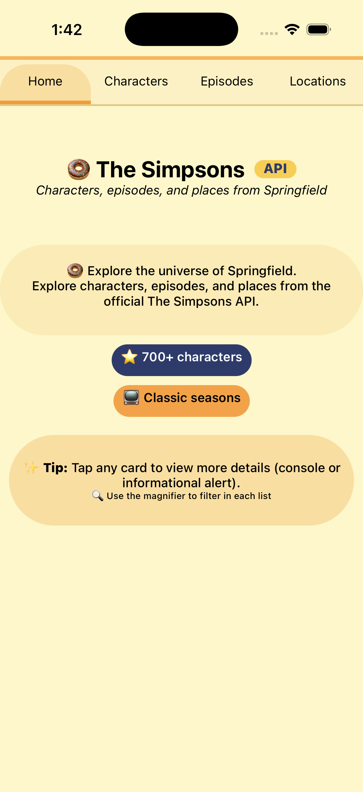 | 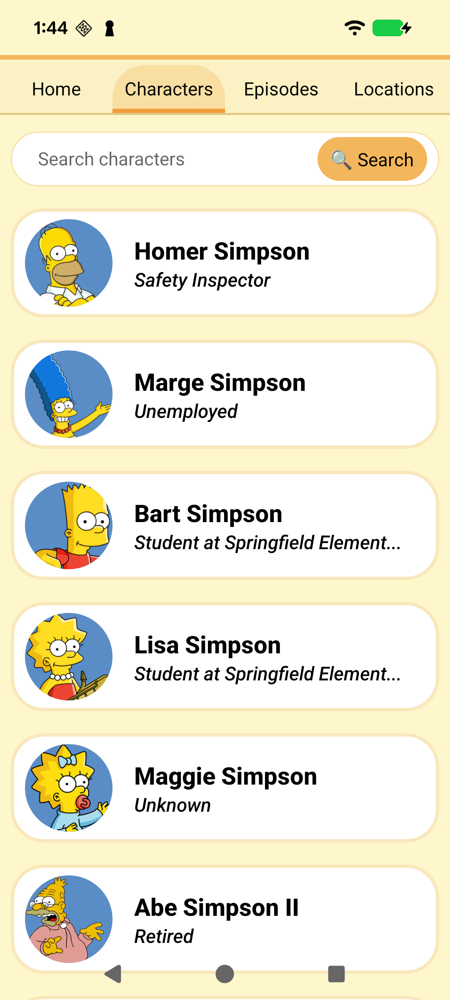 |

### Characters

| iOS | Android | 
| --- | --- | 
| 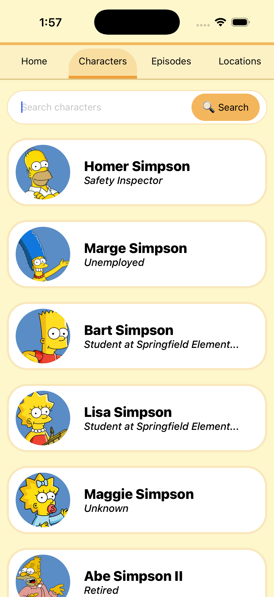 |  |

### Characters detail

| iOS | Android | 
| --- | --- | 
| 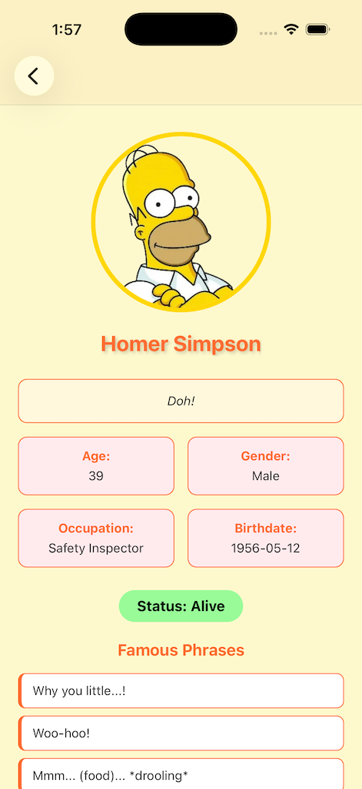 | 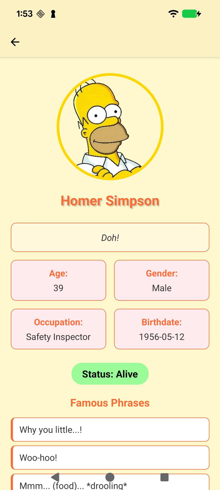 |

### Episodes

| iOS | Android | 
| --- | --- | 
| 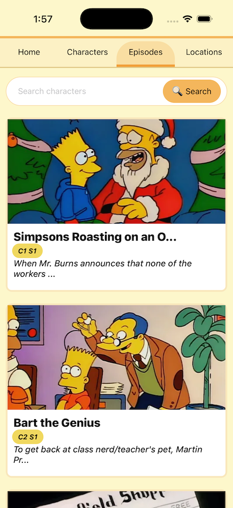 | 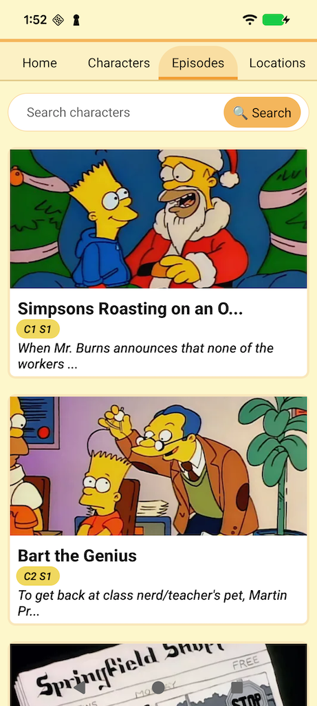 |

### Episodes Detail

| iOS | Android | 
| --- | --- | 
| 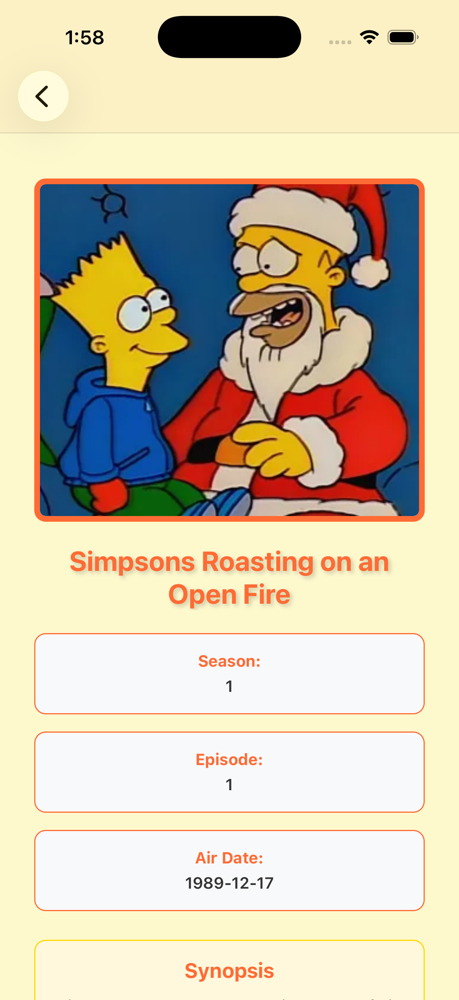 | 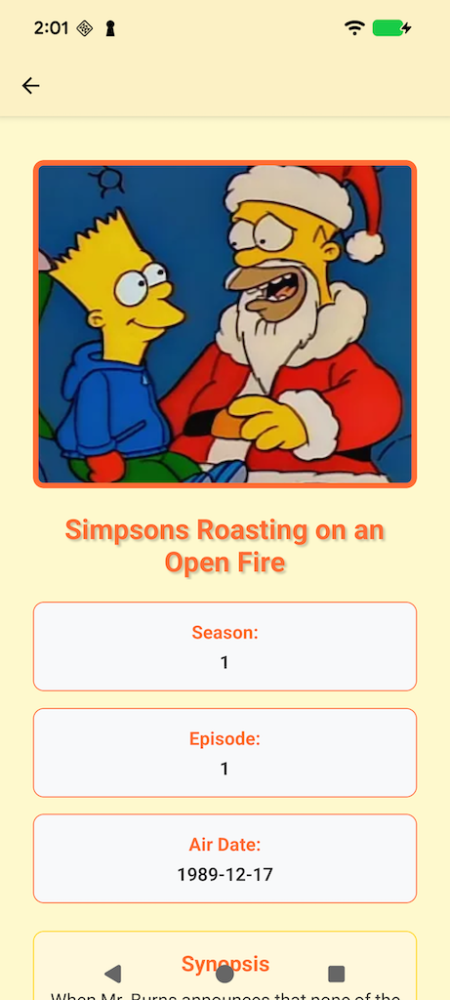 |


### Locations

| iOS | Android | 
| --- | --- | 
| 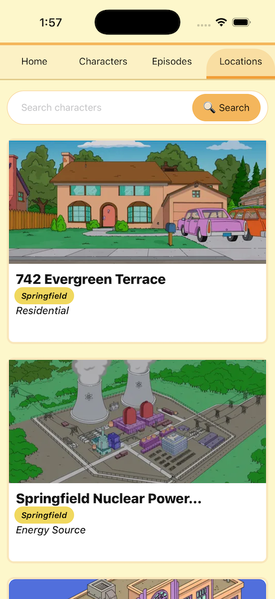 | 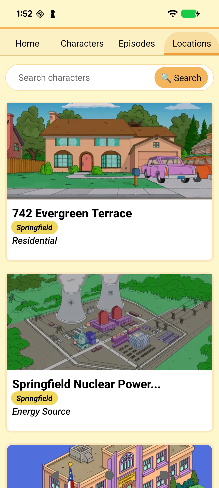 |

### Locations Detail

| iOS | Android | 
| --- | --- | 
|  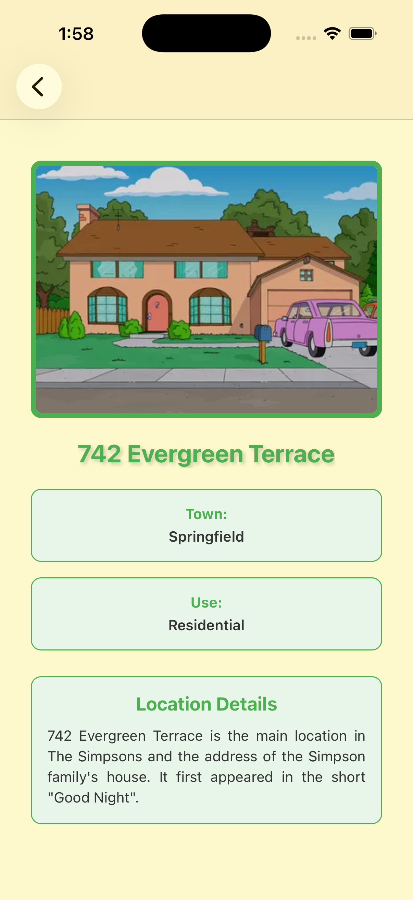 | 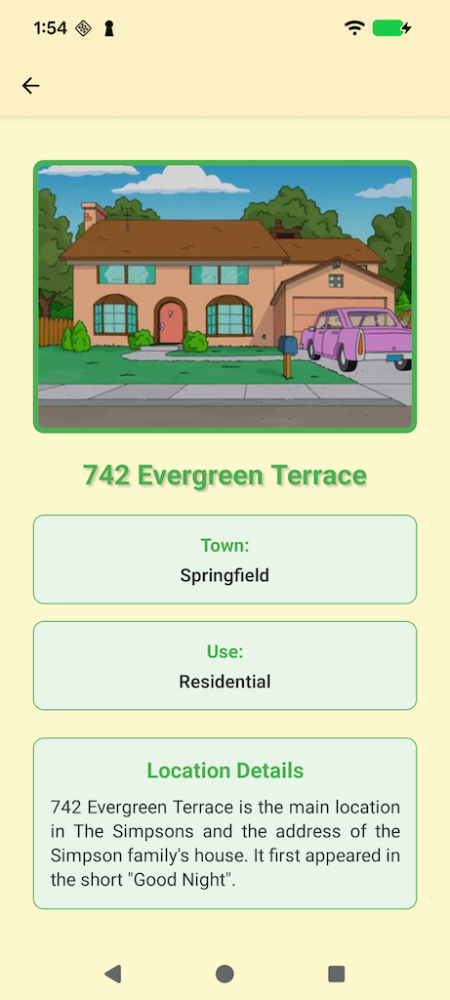 |